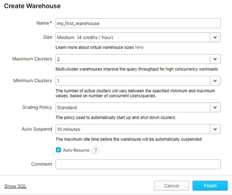
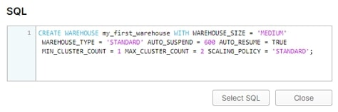

Lab 12: Defining Virtual Warehouses 
===================================


One of the first things you'll do when setting up your Snowflake
environment is to establish your virtual warehouses. What this boils
down to, essentially, is how much compute you want to use and how
segregated that compute will be.

What Is a Virtual Warehouse?
----------------------------

Warehouses are required for queries, as well as for operations like
loading data into tables. They come in a variety of T-shirt sizes
ranging from extra small to 4XL, with each representing an increase in
the hardware resources available for you to use.

Warehouses can be started and stopped at any time. They can also be
resized at any time, even while running, to accommodate the need for
more or fewer compute resources, depending on the type of operations you
are performing at that time.

If you are on the Enterprise or higher edition of Snowflake, the
warehouses can also be configured to scale outwards by adding more
servers to a cluster. Doing so provides a boost in parallel processing
capabilities, which is useful when you have a surge in concurrent
activity.

A warehouse can be created using the web interface by any Snowflake user
with the appropriate rights. Simply select Warehouses from the menu
ribbon and then click on the Create button. You'll see a dialog like
this where you can define the name, size and other attributes about the
warehouse:



You can also script a warehouse. You can use the **Show SQL** link on
the above dialog to give you a headstart, as it will translate the
information you enter and the selections you make into the SQL needed to
create that warehouse:



But how many warehouses do I need? And when do you know to scale up vs.
scale out a warehouse?

How Many Warehouses Do I Need?
------------------------------

Well, the good news is that creating warehouses doesn't cost you
anything, so you can have as many as you need. I tend to say there are
four different types of warehouses, and it's worth considering whether
your organisation will need some, or all, of these. You can optionally
combine types here, but as you'll see later in this article, they don't
necessarily share the same setup, and if you do combine, you don't fully
optimise. Below are the types of warehouses available:

-   **Staging:** Used by any process that brings information into
    Snowflake
-   **Integration**: Used when you want to transform and integrate
    information within Snowflake
-   **Consumption**: Used by any process that extracts or uses
    information hosted within Snowflake; for example, Tableau connecting
    and gathering information for use by a dashboard
-   **Labs**: Optional compute reserved exclusively for high-intensity
    requests from Data Scientists and Data Citizens within your
    organisation

How many of each warehouse type you need is influenced by several
contributing factors:

-   **Isolation of Workload**: If you want to load a lot of information
    into Snowflake from various sources in parallel---as might be the
    case with a nightly load---or maybe you want to reserve or secure
    compute for specific users, it can be useful to define multiple
    warehouses of either a staging or consumption type.
-   **Usage Chargeback**: If your data analytics delivery model relies
    on funding from different departments, then creating separate
    consumption and/or lab warehouses for each consumer group can help
    you to track and chargeback as applicable.

If you're wondering what makes these warehouses different, let me
elaborate.

Staging
-------

A staging warehouse switches on for just long enough to stage
information from a source:


```
 CREATE OR REPLACE WAREHOUSE "STG_XXXX" 
 WITH WAREHOUSE_SIZE = 'X-SMALL' 
 AUTO_SUSPEND = 60 
 AUTO_RESUME = TRUE 
 MIN_CLUSTER_COUNT = 1 
 MAX_CLUSTER_COUNT = 1 
 SCALING_POLICY = 'STANDARD'
 INITIALLY_SUSPENDED = TRUE
COMMENT = 'For the staging of information from XXXX source';
```

-   Start with the smallest warehouse and scale up as needed to load
    information in a timely manner.
-   Experiment with scaling outward to improve performance if you are on
    Enterprise edition and already beyond an XS T-shirt size.
-   You might set up access rights for this type of warehouse to be
    sized up or down by your ELT platform as it needs the extra compute.

Integration
-----------

An integration warehouse stays on for longer and generally has a lot to
do when transforming and integrating information:


```
CREATE OR REPLACE WAREHOUSE "INT_General" 
    WITH WAREHOUSE_SIZE = 'SMALL' 
    AUTO_SUSPEND = 300 
    AUTO_RESUME = TRUE 
    MIN_CLUSTER_COUNT = 1 
    MAX_CLUSTER_COUNT = 2 
    SCALING_POLICY = 'STANDARD'
    INITIALLY_SUSPENDED = TRUE
    COMMENT = 'For all data integration within the EDW';
```

-   Start with a small warehouse and scale up as needed to integrate
    information in a timely manner.
-   Review your cluster counts as you increase warehouse size, but
    consciously increment the maximum number of servers in the cluster
    to reach optimal processing capabilities. Don't just set it to the
    maximum available for that T-shirt size.
-   If you see the warehouse suspending routinely during the integration
    process, increase the auto-suspend timeout.

You could combine staging and integration warehouse types and have just
one type here; a lot of people do. I always consider the separation when
those influencing factors I mentioned above come into play or where I
may need to separate resources for data security purposes.

Consumption
-----------

Consumption warehouses are split either by function or
department---whichever is a natural and required level of separation
within your business. They should stay on for longer and only scale when
resources are in high demand:


```
CREATE OR REPLACE WAREHOUSE "OUT_XXXX" 
WITH WAREHOUSE_SIZE = 'X-SMALL' 
AUTO_SUSPEND = 600 
AUTO_RESUME = TRUE 
MIN_CLUSTER_COUNT = 1 
MAX_CLUSTER_COUNT = 1 
SCALING_POLICY = 'ECONOMY' 
INITIALLY_SUSPENDED = TRUE
COMMENT = 'VW for all data analytics delivered by XXXX';
```

-   Start with the smallest warehouse and scale up by benchmarking
    performance from the BI tool or the process that is extracting
    information.
-   Increase the auto-suspend timeout if the BI tool (or process) makes
    infrequent requests. This will maximise cache usage and result in a
    faster return of results for subsequent requests for similar
    information.

Labs
----

Labs are your secret weapon when a group wants dedicated resources and
may put extraordinary load on Snowflake (which it can take), but maybe
you want to keep a watchful eye on their usage.

The definition of the warehouse really depends upon their needs, but I
also establish a `Resource Monitor`
to monitor their consumption for me:


```
CREATE RESOURCE MONITOR "RM_LAB_OPERATIONS" 
WITH CREDIT_QUOTA = 30, frequency = 'MONTHLY'
TRIGGERS 
ON 80 PERCENT DO NOTIFY
ON 120 PERCENT DO SUSPEND;
 
ALTER WAREHOUSE “LAB_OPERATIONS SET RESOURCE_MONITOR = "RM_LAB_OPERATIONS";
```

You must be an account admin to establish these resource monitors, but
doing so gives you an early indication of excessive usage. They can be
set up to inform you and the users that they are approaching or
exceeding the assigned quota. The monitor can be configured to solely
notify, or it can take steps to restrict usage.

Tips for Naming Your Warehouses
-------------------------------

When it comes to naming your warehouses, I always recommend these good
habits:

-   Distinguish which type of warehouse it is. I use the prefixes STG,
    INT, OUT and LAB.
-   Keep your names short. When you select a warehouse in the context
    menu of a worksheet, you can only see the first 14 characters, so by
    keeping it short, you'll be able to see the full name.
-   Don't include the size of the warehouse in the name. As we've
    already said, a warehouse can be scaled up or down at any time, and
    the interface tells you in other ways what size it is presently.
-   Include a more verbose description of the warehouse purpose in the
    comments attribute. Hovering over a warehouse at different places in
    the web interface often pops up the comments in the accompanying
    tooltip, helping those with access to multiple warehouses decide on
    the most appropriate to use.
