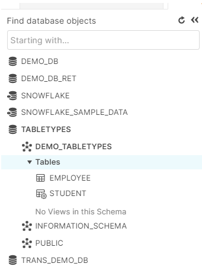

Lab 13: Table Types in Snowflake
================================


Tables are database objects logically structured as a collection of rows
and columns. All data in Snowflake is stored in database tables. Apart
from standard database tables, Snowflake supports other table types that
are especially useful for storing data that does not need to be
maintained for extended periods of time.

When data is loaded into Snowflake, Snowflake reorganizes that data into
its internal optimized, compressed, columnar format. Snowflake stores
this optimized data in cloud storage.

Snowflake supports different types of tables

- Permanent Table
- Transient Table
- Temporary Table
- External Table

**Permanent Table:**

These are the standard, regular database tables. Permanent tables are
the default table type in Snowflake and do not need any additional
syntax while creating to make them permanent.

```
create database TableTypes;
create schema Demo_TableTypes;
-- Permanent Table
create table employee (empid number, name varchar(50));
```


The data stored in permanent tables consumes space and contributes to
the storage charges that Snowflake bills your account. It also comes
with additional features like Time-Travel and Fail-Safe which helps in
data availability and recovery.

**Transient Table:**

Transient tables in Snowflake are similar to permanent tables except
that that they do not have a Fail-safe period and only have a very
limited Time-Travel period. These are best suited in scenarios where the
data in your table is not critical and can be recovered from external
means if required.

Transient tables, like permanent tables, contribute to your account's
overall storage expenses. However, since Transient Tables do not use
Fail-safe, there are no Fail-safe costs (i.e. the costs associated with
maintaining the data required for Fail-safe disaster recovery).

To create a Transient table in Snowflake, You need to mention
***transient*** in the create table syntax.

```
create transient table student (regno number, studentname varchar(50));
```


**Temporary Table:**

Snowflake supports creating temporary tables to store transient,
non-permanent data. Temporary tables exist only within the session. They
are created and persist only for the session remainder. They are not
visible to other sessions or users and don't support standard features
like cloning.

Therefore the data stored in the system is cleaned entirely and is not
recoverable either by the user-created table or Snowflake.

```
-- Temporary Table
create temporary table Supermarket (Pono number, BatchName varchar(50));
```


PFB the icon displayed for **different tables**,


Though Temporary tables are dropped at the end of the session, Snowflake
recommends explicitly dropping these tables once they are no longer
needed to prevent any unexpected storage changes when working with large
temporary tables.

If logout the particular session and re login then particular temporary
table will not be displayed.



As shown in **Figure 1.1**, the temporary table (SUPERMARKET) has been
dropped after relogging in.

Next, will will cover how to differentiate Temporary Tables from Non-Temporary Tables.


Types of Table in Snowflake
======================================

In this section, we see about **How Snowflake behave
when we create temporary table that has the same name as an existing
table in the same schema?**

Before answering this question let's see how to find type of table
present in database.

> SHOW TABLES --- Lists the tables for which you have access privileges,
> including dropped tables that are still within the Time Travel
> retention period and, therefore, can be undropped.


**Syntax:**

```
SHOW TABLES;
```

**Example:**

```
SHOW TABLES;
```

**Output:**


**Scenario 1:**

**When you create a temporary table that has the same name as an existing table in the same schema ?**

Snowflake supports creating a temporary table that has the same name as
an existing permanent/transient table in the same schema. However, note
that the temporary table takes precedence in the session over any other
table with the same name in the same schema.

Temporary table take precedence and hides the existing non-temporary table. 
===========================================================================

**Screenshot 1:** Before creating temporary table in my database.


**Screenshot 2:**After creating temporary table in my database,


In above screenshot Temporary table take precedence and hides the
existing permanent table.

**Scenario 2:**

**When you create a table that has the same name as an existing
temporary table in the same schema ?**

The newly-created table is hidden by the temporary table. 
=========================================================

**Screenshot 1:** Before creating permanent table same name like
temporary table name in my database.


**Screenshot 2:** After creating permanent table (Account) same name
like temporary table (Account) name in my database.


In above screenshot Temporary table take precedence and hides the newly
created permanent table.

All queries and other operations performed in the session on the table
effect only the temporary table.

Comparison of Snowflake Table Types 
===================================

The below table summarizes the differences between the three table
types, particularly with regard to their impact on Time Travel and
Fail-safe:


