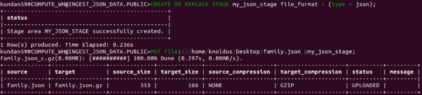
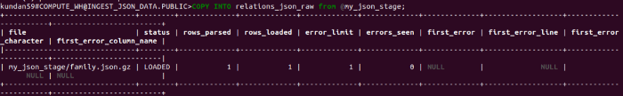
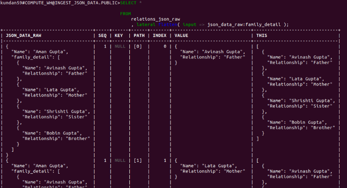
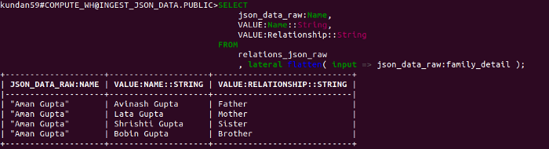
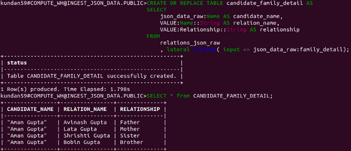
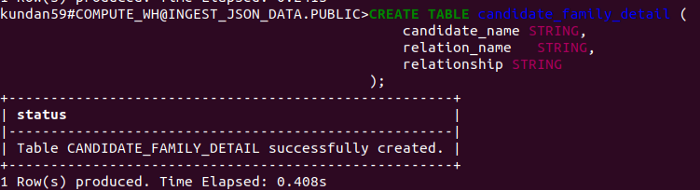
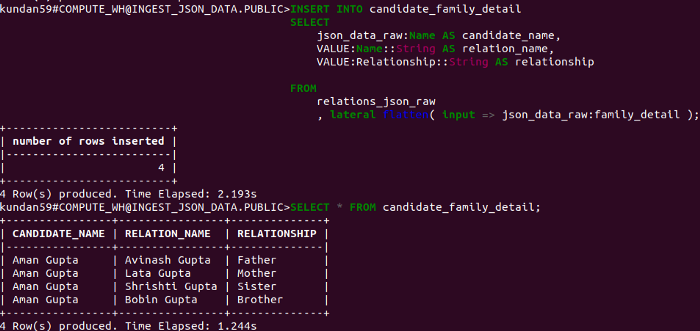

Lab 14: Loading JSON data into Snowflake 
========================================


Have you ever faced any use case or scenario where you've to ***load
JSON data into*** the **Snowflake**? We better know JSON data is one of the common data format to store
and exchange information between systems. JSON is a relatively concise
format. If we are implementing a database solution, it is very common
that we will come across a system that provides data in JSON format.
Snowflake has a very straight forward approach to load JSON data. In
this blog, we will understand this approach in a step-wise manner.

1. Stage the JSON data 
----------------------

The JSON data looks like:

```
{
  "Name": "Aman Gupta",
  "family_detail": [
    {
      "Name": "Avinash Gupta",
      "Relationship": "Father",
    },
    {
      "Name": "Lata Gupta",
      "Relationship": "Mother",
    },
    {
      "Name": "Shrishti Gupta",
      "Relationship": "Sister",
    },
    {
      "Name": "Bobin Gupta",
      "Relationship": "Brother",
    }
  ]
}
```

Create `family.json` file with above content and save it. Also, update file path in below command.

In snowflake Staging the data means, make the data available in
Snowflake ***stage***(intermediate storage) it can be **internal or external**. Staging JSON data in Snowflake is similar to staging any
other files. Let's Staging JSON data file from a **local file system.**

```
CREATE OR REPLACE STAGE my_json_stage file_format = (type = json);
PUT file:///home/knoldus/Desktop/family.json @my_json_stage;
```




2. Load JSON data as raw into temporary table 
---------------------------------------------

To load the JSON data as raw, first, create a table with a column of
VARIANT type. VARIANT can contain any type of data so it is suitable for
loading JSON data.

```
CREATE TABLE relations_json_raw (
  json_data_raw VARIANT
);
```

Now let's **copy** the JSON file into **relations\_json\_raw** table.

```
COPY INTO relations_json_raw from @my_json_stage;
```

**Note that a file format does not need to be specified because it is
included in the stage definition.**



3. Analyze and prepare raw JSON data 
------------------------------------

The next step would be **to analyze** the **loaded raw JSON data**.
Determining what information needs to be extracted from JSON data. For
example, in our case, we are interested to extract the name key and from
the family\_detail array object, we want to extract the name and
relationship key from each JSON object. The below query will do that.

```
SELECT
    json_data_raw:Name, 
    VALUE:Name::String, 
    VALUE:Relationship::String 
FROM
    relations_json_raw
    , lateral flatten( input => json_data_raw:family_detail );
```

The above query using **lateral join** and a **flatten functio**n. The
flatten function returns a row for each JSON object from the
family\_detail array. and the lateral modifier joins the data with any
information outside of the object, in our example candidate name that we
are extracting with **json\_data\_raw: Name.**





Load Data into target table 
---------------------------

Now we have analyzed and extracted information. We can load the
extracted data into the target table.

```
CREATE OR REPLACE TABLE candidate_family_detail AS
SELECT
    json_data_raw:Name AS candidate_name,
    VALUE:Name::String AS relation_name,
    VALUE:Relationship::String AS relationship

FROM
    relations_json_raw
    , lateral flatten( input => json_data_raw:family_detail );
```



If you don't want to do a "create table as", you can pre-create a table
and then insert the JSON data into the table.






