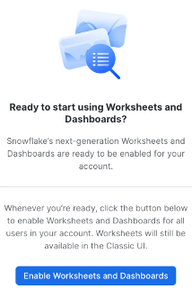
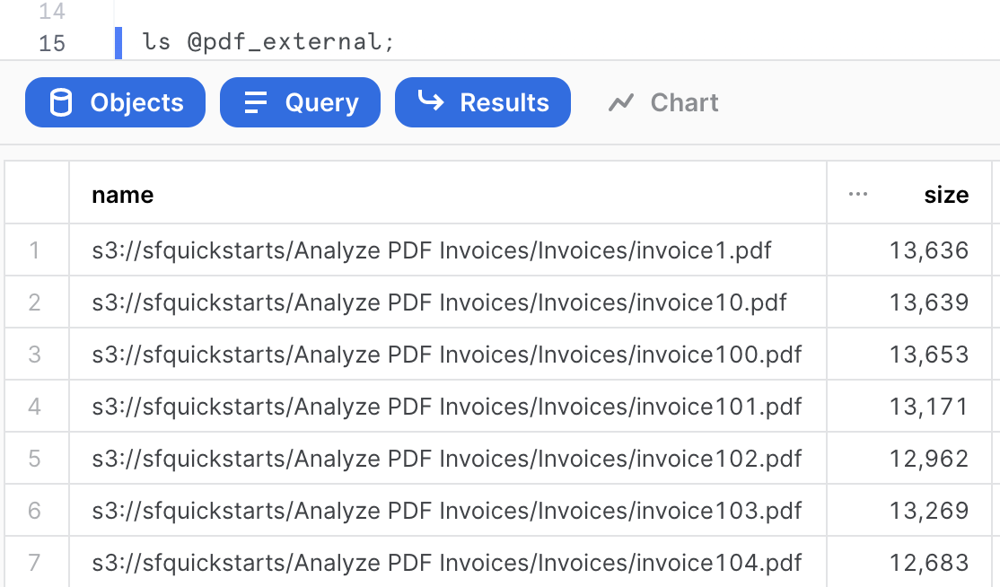
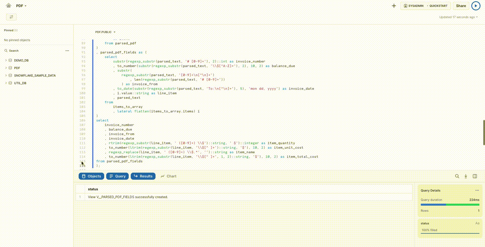
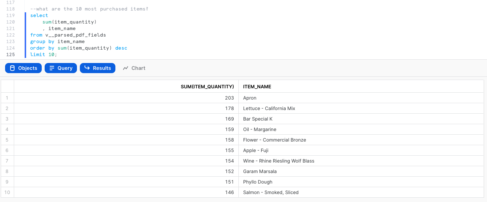
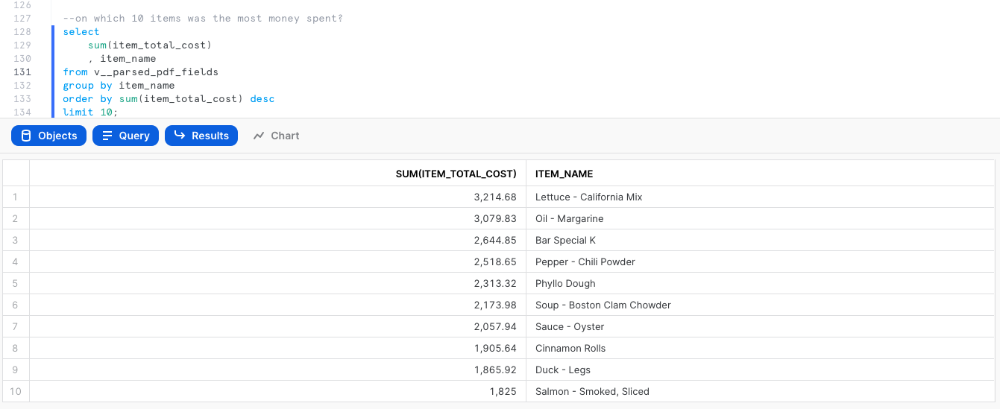
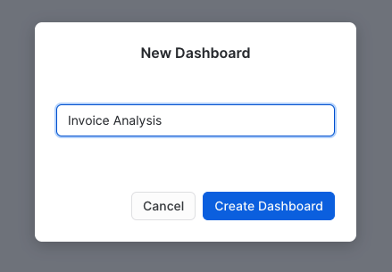
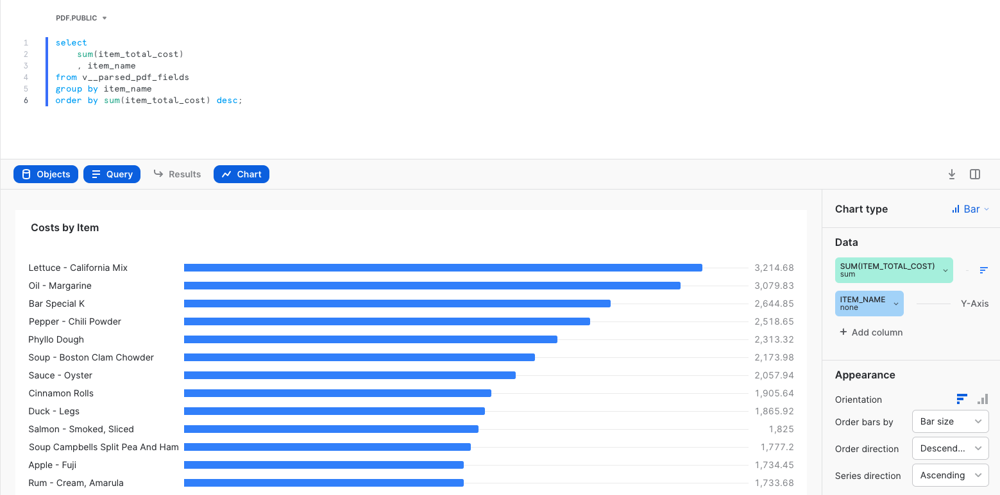

# Lab 4: Analyze PDF Invoices using Java UDF and Snowsight
<!-- ------------------------ -->
## Overview 


This lab is designed to help you understand the capabilities included in Snowflake’s support for unstructured data and Snowpark. Although this guide is specific to processing PDF files, you can apply this pattern of processing natively in Snowflake to many types of unstructured data. All source code for this guide can be found on [Github](https://github.com/fenago/snowflake-intro).


### What You'll Need
- Snowflake account
- SnowSQL installed

### What You’ll Learn 
- How to access PDF invoices in cloud storage from Snowflake
- How to extract text from PDFs natively using a Java User-Defined Function (UDF)

### What You'll Build
- An external stage to access files in S3 from Snowflake
- A user-defined function using Snowflake's engine to process files

<!-- ------------------------ -->
## Prepare Your Environment


If you haven't already, register for a [Snowflake free 30-day trial](https://trial.snowflake.com/).
The Snowflake edition (Standard, Enterprise, Business Critical, e.g.), cloud provider (AWS, Azure, e.g.), and Region (US East, EU, e.g.) do not matter for this lab. We suggest you select the region which is physically closest to you and the Enterprise Edition, our most popular offering. After registering, you will receive an email with an activation link and your Snowflake account URL.

### Navigating to Snowsight
For this lab, you will use the latest Snowflake web interface, Snowsight.
1. Log into your Snowflake trial account
2. Click on __Snowsight__ Worksheets tab. The new web interface opens in a separate tab or window.
3. Click __Worksheets__ in the left-hand navigation bar. The __Ready to Start Using Worksheets and Dashboards__ dialog opens.
4. Click the __Enable Worksheets and Dashboards button__.



<!-- ------------------------ -->
## Access the Data


Let’s start by loading the PDF invoices into Snowflake. Snowflake supports two types of stages for storing data files used for loading and unloading:
- [Internal] stages store the files internally within Snowflake.
- [External] stages store the files in an external location (i.e. S3 bucket) that is referenced by the stage. An external stage specifies location and credential information, if required, for the bucket.

For this lab, we will use an external stage, but processing and analysis workflows demonstrated in this lab can also be done using an internal stage.

### Create a Database, Warehouse, and Stage
Let's create a database, warehouse, and stage that will be used for loading and processing the PDFs. We will use the UI within the Worksheets tab to run the DDL that creates the database and schema. Copy the commands below into your trial environment, and execute each individually.

```sql
use role sysadmin;

create or replace database pdf;
create or replace warehouse quickstart;

use database pdf;
use schema public;
use warehouse quickstart;

create or replace stage pdf_external
url="s3://sfquickstarts/Analyze PDF Invoices/Invoices/"
directory = (enable = TRUE);
```

Verify if the PDF files are accessible in your external stage by entering the following command on your Snowflake worksheet.

```sql
ls @pdf_external;
```

You should now see an identical list of files from the S3 bucket. Make sure you see 300 files.



<!-- ------------------------ -->
## Extract Text from PDFs


In this section, we want to extract attributes from the PDF invoices. The entities extracted are going to be fields like product names, unit cost, total cost, as well as business name. The goal is to have these fields to enrich the file-level metadata for analytics.

### Creating a Java UDF in Snowflake
The Java code to parse PDFs requires some dependencies. Instead of downloading those jar files and uploading to an internal stage, you can create an external stage and reference them when creating a UDF inline.

```sql
-- Create stage to store the JAR file
create or replace stage jars_stage_internal;

-- Create external stage to import PDFBox from S3
create or replace stage jars_stage
 url = "s3://sfquickstarts/Common JARs/"
 directory = (enable = true auto_refresh = false);

-- Create a java function to parse PDF files
create or replace function read_pdf(file string)
returns String
language java
imports = ('@jars_stage/pdfbox-app-2.0.24.jar')
HANDLER = 'PdfParser.ReadFile'
as
$$
import org.apache.pdfbox.pdmodel.PDDocument;
import org.apache.pdfbox.text.PDFTextStripper;
import org.apache.pdfbox.text.PDFTextStripperByArea;

import java.io.File;
import java.io.FileInputStream;
import java.io.IOException;
import java.io.InputStream;

import com.snowflake.snowpark_java.types.SnowflakeFile;

public class PdfParser {

    public static String ReadFile(String file_url) throws IOException {
SnowflakeFile file = SnowflakeFile.newInstance(file_url);
        try (PDDocument document = PDDocument.load(file.getInputStream())) {

            document.getClass();

            if (!document.isEncrypted()) {

                PDFTextStripperByArea stripper = new PDFTextStripperByArea();
                stripper.setSortByPosition(true);

                PDFTextStripper tStripper = new PDFTextStripper();

                String pdfFileInText = tStripper.getText(document);
                return pdfFileInText;
            }
        }

        return null;
    }
}
$$;
```

### Invoking the Java UDF
The UDF can be invoked on any PDF file with a simple SQL statement. First, make sure to refresh the directory table metadata for your external stage.

```
alter stage pdf_external refresh;

select read_pdf('@pdf_external/invoice1.pdf') 
as pdf_text;
```


The output is text values extracted from `invoice1.pdf`.

```text
INVOICE
# 1
Abbott Group
Bill To:
Aug 5, 2021
$458.10
Date:
Balance Due:
Item Quantity Rate Amount
Flour - Corn, Fine 18 $11.39 $205.02
Hold Up Tool Storage Rack 14 $9.54 $133.56
Scallop - St. Jaques 9 $13.28 $119.52
$458.10Total:
```

UDFs are account-level objects. So if a developer familiar with Java creates a UDF, an analyst in the same account with proper permissions can invoke the UDF in their queries.

### Extracting and Storing Fields
We want to store the extracted text as additional attributes for analysts to be able to select and retrieve the files of interest in their analysis, as well as perform some analytics on the attributes found.

We first need to create a table with the extracted text in its raw form. From this table, we can create views to parse the text into various fields for easier analysis.

```sql
create or replace table parsed_pdf as
select
    relative_path
    , file_url
    , read_pdf('@pdf_external/' || relative_path) as parsed_text
from directory(@pdf_external);
```

Using Snowflake’s string functions, we can parse out specific values as fields like balance due, item name, item quantity, and more.

```sql
create or replace view v__parsed_pdf_fields as (
with items_to_array as (
    select
        *
        , split(
            substr(
              regexp_substr(parsed_text, 'Amount\n(.*)\n(.*)\n(.*)'
              ), 8
            ), '\n'
          )
        as items
    from parsed_pdf
)
, parsed_pdf_fields as (
    select
        substr(regexp_substr(parsed_text, '# [0-9]+'), 2)::int as invoice_number
        , to_number(substr(regexp_substr(parsed_text, '\\$[^A-Z]+'), 2), 10, 2) as balance_due
        , substr(
            regexp_substr(parsed_text, '[0-9]+\n[^\n]+')
                , len(regexp_substr(parsed_text, '# [0-9]+'))
            ) as invoice_from
        , to_date(substr(regexp_substr(parsed_text, 'To:\n[^\n]+'), 5), 'mon dd, yyyy') as invoice_date
        , i.value::string as line_item
        , parsed_text
    from
        items_to_array
        , lateral flatten(items_to_array.items) i
)
select
    invoice_number
    , balance_due
    , invoice_from
    , invoice_date
    , rtrim(regexp_substr(line_item, ' ([0-9]+) \\$')::string, ' $')::integer as item_quantity
    , to_number(ltrim(regexp_substr(line_item, '\\$[^ ]+')::string, '$'), 10, 2) as item_unit_cost
    , regexp_replace(line_item, ' ([0-9]+) \\$.*', '')::string as item_name
    , to_number(ltrim(regexp_substr(line_item, '\\$[^ ]+', 1, 2)::string, '$'), 10, 2) as item_total_cost
from parsed_pdf_fields
);
```

If you collapse and expand the `PDF` database in the Objects pane on the left, you should now see a view name `V__PARSED_PDF_FIELDS`. Click on that view, and below you should see a preview of the fields you have created along with icons to indicate the data type. You can also see a preview of the view by clicking on the button that looks like a magnifier glass.



### Exploring Invoice Data
Now let’s explore the data from the PDF invoices. What are the most purchased items based on quantity?

```sql
select
    sum(item_quantity)
    , item_name
from v__parsed_pdf_fields
group by item_name
order by sum(item_quantity) desc
limit 10;
```



What are the items on which the most money was spent?

```sql
select
    sum(item_total_cost)
    , item_name
from v__parsed_pdf_fields
group by item_name
order by sum(item_total_cost) desc
limit 10;
```



<!-- ------------------------ -->
## Analyze the Data with Snowsight


Now we can use Snowsight to visualize the data extracted from the PDF invoices.

### Create a Dashboard
Let's use a dashboard as a collection of all of the visualizations we will create. Click on the Home button, then click on __Dashboards__ in the pane on the left. Create a new dashboard by clicking the __+ Dashboard__ button in the top-right. Name the dashboard `Invoice Analysis`, and click __Create Dashboard__.



Now let's create the first tile on the Invoice Analysis dashboard by clicking the button __+ New Tile__. Give the tile a name by clicking on the timestamp at the top, and name it `Costs by Item`. In the canvas, copy/paste the SQL below to query the data needed for the chart and run it.

```sql
select
    sum(item_total_cost)
    , item_name
from v__parsed_pdf_fields
group by item_name
order by sum(item_total_cost) desc;
```

Now click on __Chart__. Change the chart type from line to bar, X-Axis to `ITEM_NAME`, and orientation to horizontal. In this chart, you should see "Lettuce - California Mix" as the item on which the most money was spent, $3,214.68.



Now let's create another tile by clicking __Return to Invoice Analysis__ in the top-left, then click on the __+__ button, then __New Tile from Worksheet__. Name the tile `Costs by Month`. Now copy/paste and run this query.

```sql
select
    sum(item_total_cost)
    , date_trunc('month', invoice_date) as month
from v__parsed_pdf_fields
group by date_trunc('month', invoice_date);
```

Again, click __Chart__. You should see a line chart with `MONTH` on the x-axis and `SUM(ITEM_TOTAL_COST)` on the y-axis. Then click __Return to Invoice Analysis__. You should now see two tiles on your dashboard, which you can rearrange by clicking and dragging.


<!-- ------------------------ -->
## Conclusion


Congratulations! You used Snowflake to analyze PDF invoices.

### What we’ve covered
- Accessing unstructured data with an __external stage__
- Processing unstructured data with a __Java UDF__
- Visualize data with __Snowsight__

