# Getting Started with Snowpark and the Dataframe API 

<!-- ------------------------ -->
## Overview

This project will demonstrate how to get started with Jupyter Notebooks on [Snowpark](https://docs.snowflake.com/en/developer-guide/snowpark/index.html), a new product feature announced by Snowflake for [public preview](https://www.snowflake.com/blog/welcome-to-snowpark-new-data-programmability-for-the-data-cloud/) during the 2021 Snowflake Summit. With this tutorial you will learn how to tackle real world business problems as straightforward as ELT processing but also as diverse as math with rational numbers with unbounded precision, sentiment analysis and machine learning.

Snowpark not only works with Jupyter Notebooks but with a variety of IDEs. Instructions on how to set up your favorite development environment can be found in the Snowpark documentation under [Setting Up Your Development Environment for Snowpark](https://docs.snowflake.com/en/developer-guide/snowpark/setup.html).

### Snowpark
Snowpark is a new developer framework of Snowflake. It brings deeply integrated, DataFrame-style programming to the languages developers like to use, and functions to help you expand more data use cases easily, all executed inside of Snowflake. Snowpark support starts with Scala API, Java UDFs, and External Functions.  

With Snowpark, developers can program using a familiar construct like the DataFrame, and bring in complex transformation logic through UDFs, and then execute directly against Snowflake’s processing engine, leveraging all of its performance and scalability characteristics in the Data Cloud. 

Snowpark provides several benefits over how developers have designed and coded data driven solutions in the past:

1. Simplifies architecture and data pipelines by bringing different data users to the same data platform, and process against the same data without moving it around.

2. Accelerates data pipeline workloads by executing with performance, reliability, and scalability with Snowflake’s elastic performance engine.

3. Eliminates maintenance and overhead with managed services and near-zero maintenance.

4. Creates a single governance framework and a single set of policies to maintain by using a single platform.

5. Provides a highly secure environment with administrators having full control over which libraries are allowed to execute inside the Java/Scala runtimes for Snowpark.

The following tutorial highlights these benefits and lets you experience Snowpark in your environment.

### Prerequisites:

This [repo](https://github.com/Snowflake-Labs/sfguide_snowpark_on_jupyter) is structured in multiple parts. Each part has a notebook with specific focus areas. All notebooks in this series require a Jupyter Notebook environment with a Scala kernel.  

All notebooks will be fully self contained, meaning that all you need for processing and analyzing datasets is a Snowflake account.  If you do not have a Snowflake account, you can sign up for a [free trial](https://signup.snowflake.com/). It doesn't even require a credit card.

- Use of the [Snowflake free 30-day trial environment](https://trial.snowflake.com)
- All notebooks in this series require a Jupyter Notebook environment with a Scala kernel.  
  - If you do not already have access to that type of environment, Follow the instructions below to either run Jupyter locally or in the AWS cloud. 
- Instructions on how to set up your favorite development environment can be found in the Snowpark documentation under [Setting Up Your Development Environment for Snowpark](https://docs.snowflake.com/en/developer-guide/snowpark/setup.html).

### What you will learn
- [Part 1](https://github.com/Snowflake-Labs/sfguide_snowpark_on_jupyter/blob/main/notebook/part1/part1.ipynb)

    The first notebook in this series provides a quick-start guide and an introduction to the Snowpark DataFrame API. The notebook explains the steps for setting up the environment (REPL), and how to resolve dependencies to Snowpark. After a simple "Hello World" example you will learn about the Snowflake DataFrame API, projections, filters, and joins.
 
- [Part 2](https://github.com/Snowflake-Labs/sfguide_snowpark_on_jupyter/blob/main/notebook/part2/part2.ipynb)

    The second notebook in the series builds on the quick-start of the first part. Using the TPCH dataset in the sample database, it shows how to use aggregations and pivot functions in the Snowpark DataFrame API. Then it introduces UDFs and how to build a stand-alone UDF: a UDF that only uses standard primitives. From there, we will learn how to use third party Scala libraries to perform much more complex tasks like math for numbers with unbounded (unlimited number of significant digits) precision and how to perform sentiment analysis on an arbitrary string.

- [Part 3](https://github.com/Snowflake-Labs/sfguide_snowpark_on_jupyter/blob/main/notebook/part3/part3.ipynb)

    The third notebook combines what you learned in part 1 and 2. It implements an end-to-end ML use case including data ingestion, ETL/ELT transformations, model training, model scoring, and result visualization.

<!-- ------------------------ -->
## Preparing your lab environment 

### Option 1:  Running Jupyter locally

The following instructions show how to build a Notebook server using a Docker container.

1. Download and install [Docker](https://docs.docker.com/get-docker/).
2. Make sure your docker desktop application is up and running.
3. Make sure you have at least 4GB of memory allocated to Docker:
    

4. Open your favorite terminal or command line tool / shell.

5. Clone the GitHub Lab [repo](https://github.com/Snowflake-Labs/sfguide_snowpark_on_jupyter): 
        cd ~
        mkdir DockerImages

        cd DockerImages
        git clone https://github.com/Snowflake-Labs/sfguide_snowpark_on_jupyter.git

6. Build the Docker container (this may take a minute or two, depending on your network connection speed)

        cd ~/DockerImages/sfguide_snowpark_on_jupyter/docker
        docker build -t snowparklab .

7. Starting your Local Jupyter environment

    Type the following commands to start the Docker container and mount the snowparklab directory to the container. The command below assumes that you have cloned the git repo to ~/DockerImages/sfguide_snowpark_on_jupyter. Adjust the path if necessary. 

        cd ~/DockerImages/sfguide_snowpark_on_jupyter
        docker run -it --rm -p 8888:8888 -e JUPYTER_ENABLE_LAB=yes -v "$(pwd)":/home/jovyan/snowparklab --name snowparklab snowparklab

    The output should be similar to the following

        To access the server, open this file in a browser:
            file:///home/jovyan/.local/share/jupyter/runtime/jpserver-15-open.html
        Or copy and paste one of these URLs:
            http://162e383e431c:8888/lab?token=bdaead06c9944057a86f9d8a823cebad4ce66799d855be5d
            http://127.0.0.1:8888/lab?token=bdaead06c9944057a86f9d8a823cebad4ce66799d855be5d

8. Start a browser session (Safari, Chrome, ...). Paste the line with the local host address (127.0.0.1) printed in **your shell window** into the browser status bar and update the port (8888) to **your port** in case you have changed the port in the step above.

Positive
:  Once you have completed this step, you can move on to the Setup Credentials Section.

Negative
:  Stopping your Docker lab environment
    
    Type the following command into a new shell window when you want to stop the tutorial. All changes/work will be saved on your local machine. 

        docker stop snowparklab
        

### Option 2:  Running Jupyter in the AWS cloud

In case you can't install docker on your local machine you could run the tutorial in AWS on an [AWS Notebook Instance](https://docs.aws.amazon.com/sagemaker/latest/dg/nbi.html).

1. Create a Notebook instance

   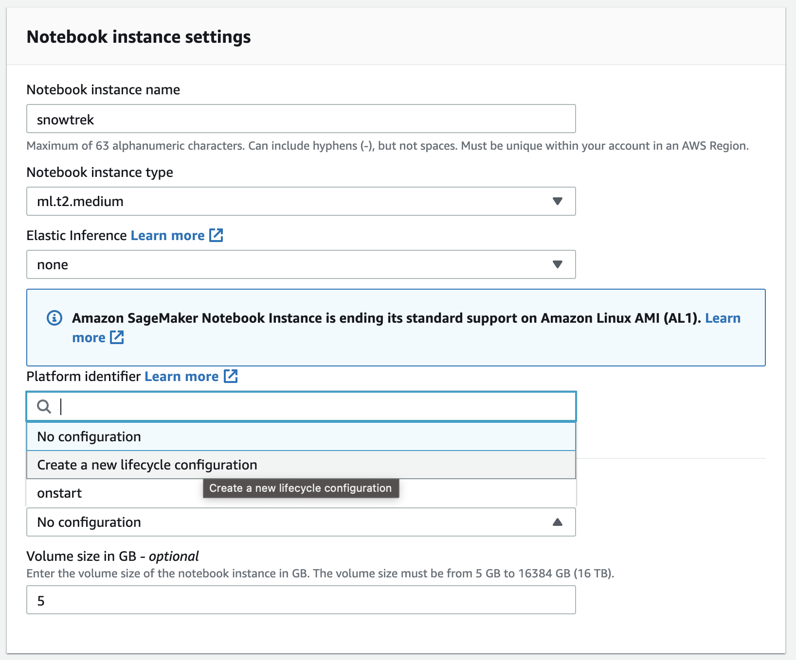

2. Create a Lifecycle Policy.

   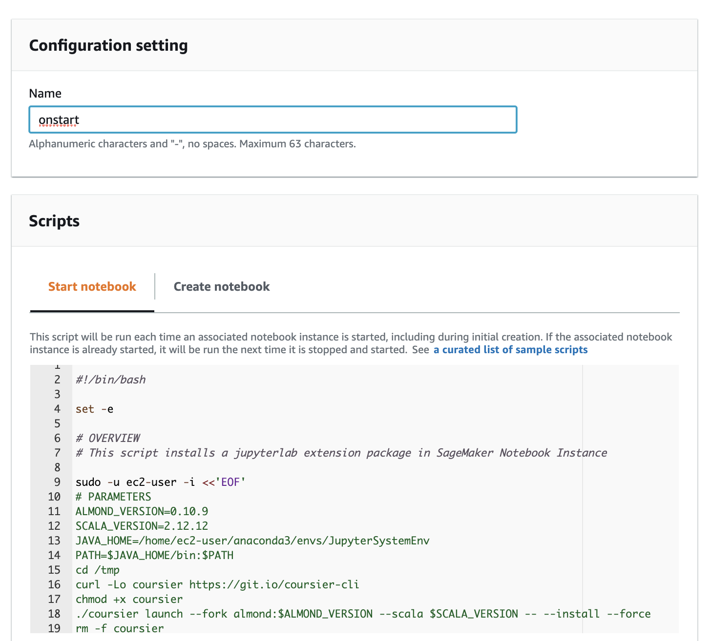

   Open the [lifecycle script](https://github.com/Snowflake-Labs/sfguide_snowpark_on_jupyter/blob/main/docker/onstart) and paste its content into the editor window.
    
   Creating the Notebook takes about 8 minutes.

3. Upload the tutorial folder (github repo zipfile)

4. Unzip folder

   Open the Launcher, start a termial window and run the command below (substitue <filename> with your filename.

        unzip SageMaker/<filename> -d SageMaker/

Positive
:  After you have set up either your docker or your cloud based notebook environment you can proceed to the next section.

<!-- ------------------------ -->
## Setup Credentials

First, we have to set up the Jupyter environment for our notebook. The full instructions for setting up the environment are in the Snowpark documentation [Configure Jupyter](https://docs.snowflake.com/en/developer-guide/snowpark/quickstart-jupyter.html#configuring-the-jupyter-notebook-for-snowpark).

#### Setup your credentials file

To create a Snowflake session, we need to authenticate to the Snowflake instance. Though it might be tempting to just override the authentication variables with hard coded values in your Jupyter notebook code, it's not considered best practice to do so. If you share your version of the notebook, you might disclose your credentials by mistake to the recipient. Even worse, if you upload your notebook to a public code repository, you might advertise your credentials to the whole world. To prevent that, you should keep your credentials in an external file (like we are doing here).

Then, update your credentials in that file and they will be saved on your local machine. Even better would be to switch from user/password authentication to [private key authentication](https://docs.snowflake.com/en/user-guide/key-pair-auth.html#key-pair-authentication-key-pair-rotation).

Positive
:  Put your key pair files into the same directory or update the location in your credentials file.

- Open your Jupyter environment in your web browser
- Navigate to the folder:  /snowparklab/creds
- Duplicate the file **template_credentials.txt**

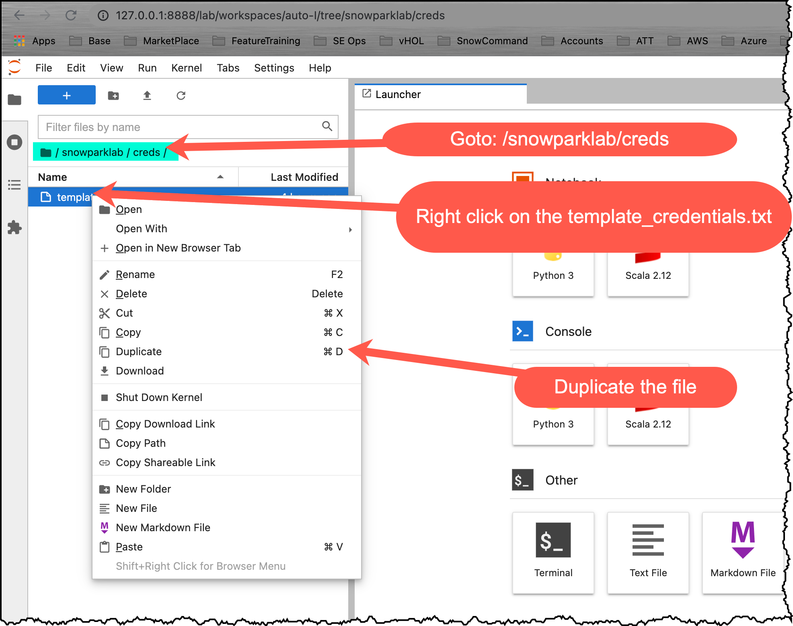

- Rename the duplicated file to **credentials.txt** (right click menu)
- Double click the **credential.txt** file to open and edit it in the Jupyter environment
- Update the file to your Snowflake environment connection parameters

Positive
:  You can comment out parameters by putting a # at the beginning of the line.

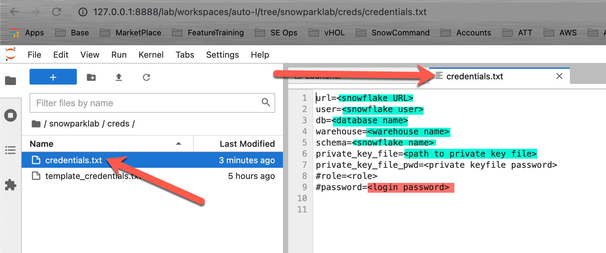

<!-- ------------------------ -->
## Part 1:  Introduction to the Snowpark DataFrame API 

This is the first notebook of a series to show how to use Snowpark on Snowflake. This notebook provides a quick-start guide and an introduction to the Snowpark DataFrame API. The notebook explains the steps for setting up the environment (REPL), and how to resolve dependencies to Snowpark. After a simple "Hello World" example you will learn about the Snowflake DataFrame API, projections, filters, and joins.

### Open the Part 1 notebook

Open your Jupyter environment.
Navigate to the folder snowparklab/notebook/part1 and Double click on the part1.ipynb to open it

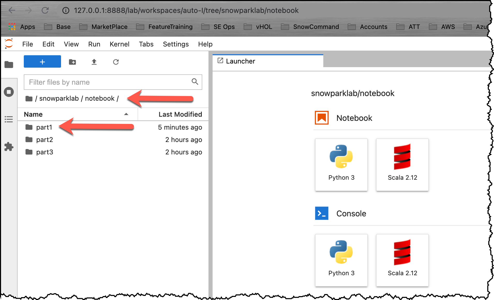

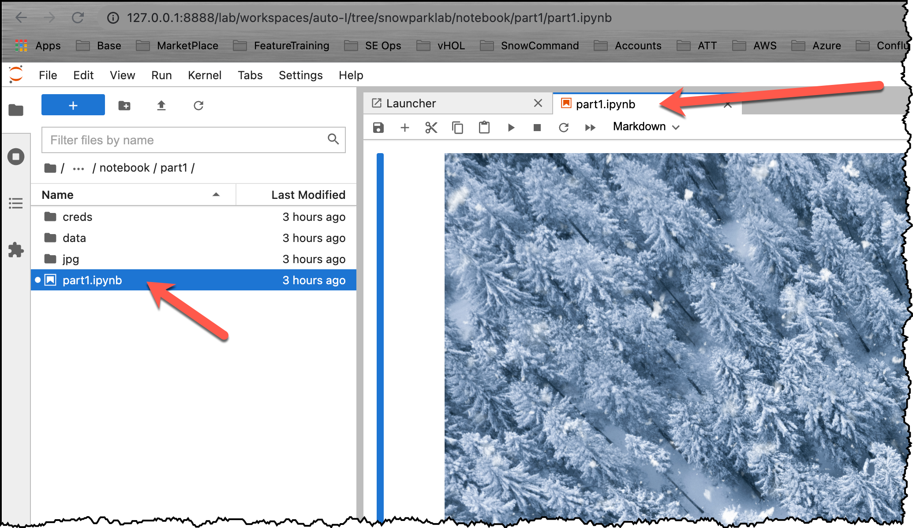

### Now read through and run each step in the notebook.

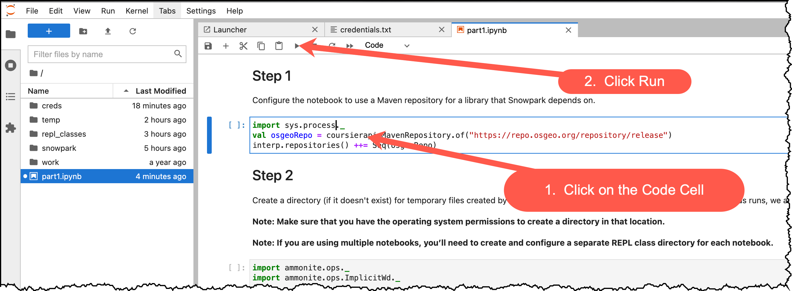

Positive
:  **Return here once you have finished the first notebook.**

<!-- ------------------------ -->
## Part 2:  Aggregations, Pivots, and UDF's 

This is the second notebook in the series. It builds on the quick-start of the first part. Using the TPCH dataset in the sample database, we will learn how to use aggregations and pivot functions in the Snowpark DataFrame API. Then, it introduces user definde functions (UDFs) and how to build a stand-alone UDF: a UDF that only uses standard primitives. From there, we will learn how to use third party Scala libraries to perform much more complex tasks like math for numbers with unbounded (unlimited number of significant digits) precision and how to perform sentiment analysis on an arbitrary string.

In this session, the focus will be on:

- Advanced API features and visualization
- User-defined functions

### Open the Part 2 notebook

Open your Jupyter environment.
Navigate to the folder snowparklab/notebook/part2 and Double click on the part2.ipynb to open it

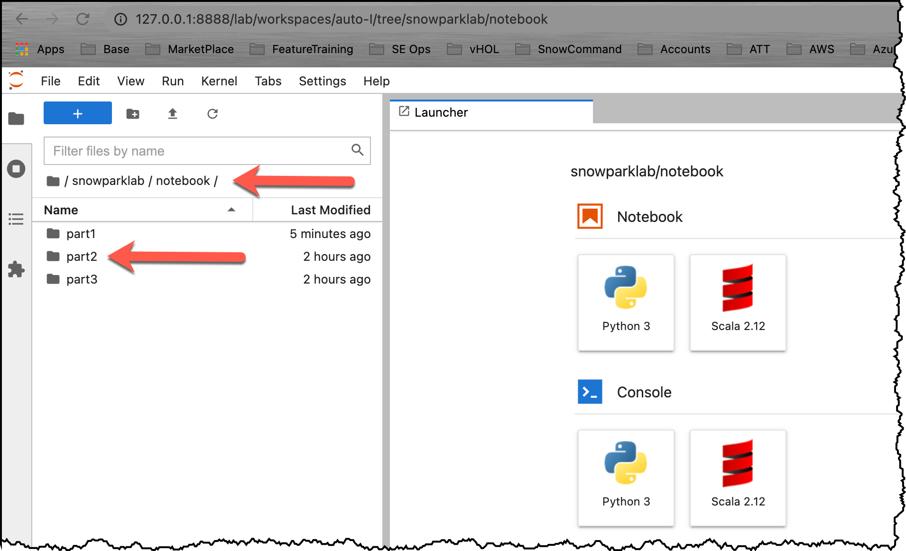

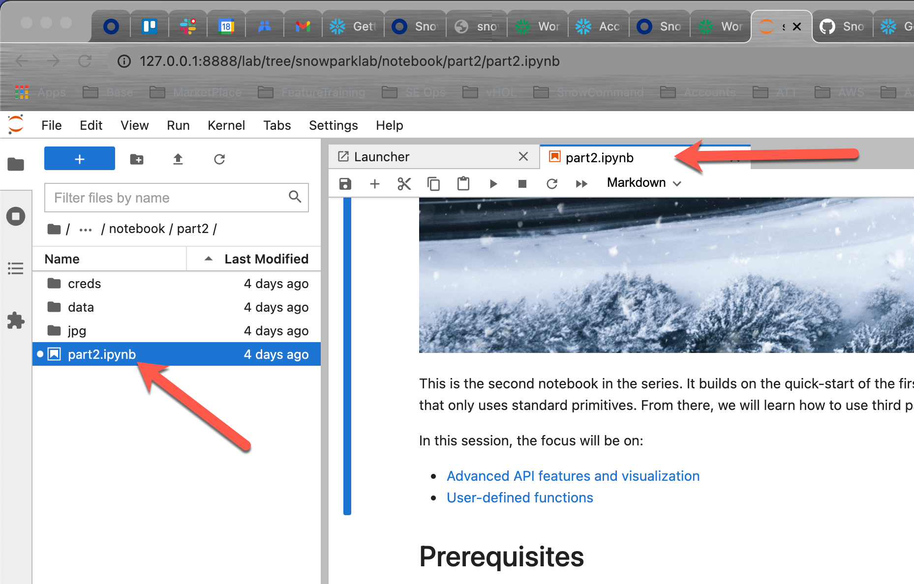

### Now read through and run each step in the notebook.

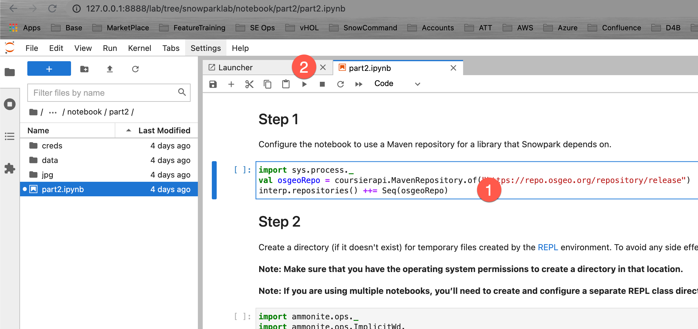

Positive
:  **Return here once you have finished the second notebook.**

<!-- ------------------------ -->
## Part 3:  Data Ingestion, transformation, and model training 

The third notebook builds on what you learned in part 1 and 2. It implements an end-to-end ML use-case including data ingestion, ETL/ELT transformations, model training, model scoring, and result visualization.

### Open the Part 3 notebook

Open your Jupyter environment.
Navigate to the folder snowparklab/notebook/part2 and Double click on the part2.ipynb to open it

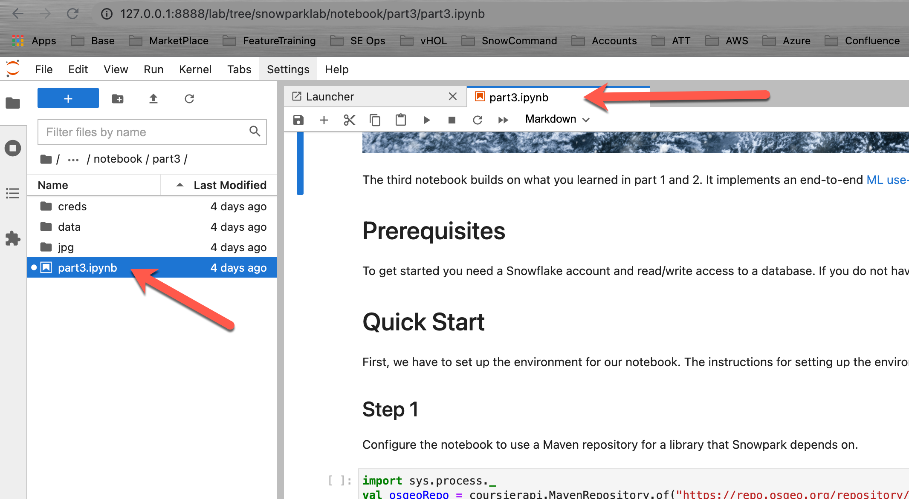

### Now read through and run each step in the notebook.

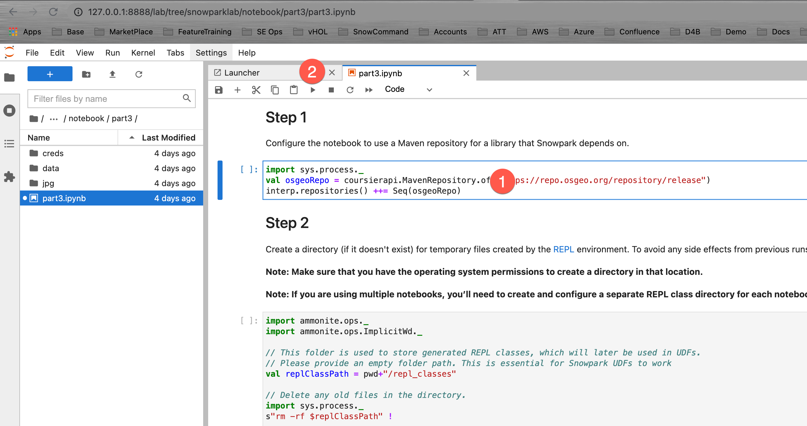

Positive
:  **Return here once you have finished the third notebook so you can read the conclusion & Next steps, and complete the guide.**

<!-- ------------------------ -->
## Conclusion & Next Steps

Snowpark is a brand new developer experience that brings scalable data processing to the Data Cloud. In Part1 of this series, we learned how to set up a Jupyter Notebook and configure it to use Snowpark to connect to the Data Cloud. Next, we built a simple Hello World! program to test connectivity using embedded SQL. Then we enhanced that program by introducing the Snowpark Dataframe API. Lastly we explored the power of the Snowpark Dataframe API using filter, projection, and join transformations.

We encourage you to continue with your free trial by loading your own sample or production data and by using some of the more advanced capabilities of Snowflake not covered in this lab. 

### Additional Resources:

- Read the [Definitive Guide to Maximizing Your Free Trial](https://www.snowflake.com/test-driving-snowflake-the-definitive-guide-to-maximizing-your-free-trial/) document
- Attend a [Snowflake virtual or in-person event](https://www.snowflake.com/about/events/) to learn more about our capabilities and customers
- [Join the Snowflake community](https://community.snowflake.com/s/topic/0TO0Z000000wmFQWAY/getting-started-with-snowflake)
- [Sign up for Snowflake University](https://community.snowflake.com/s/article/Getting-Access-to-Snowflake-University)
- [Contact our Sales Team](https://www.snowflake.com/free-trial-contact-sales/) to learn more

### What we've covered:

- Quick Start: Set up the environment
- Hello World: First steps
- Snowflake DataFrame API: Query the Snowflake Sample Datasets via Snowflake DataFrames
- Aggregations, Pivots, and UDF's using the Snowpark API
- Data Ingestion, transformation, and model training
