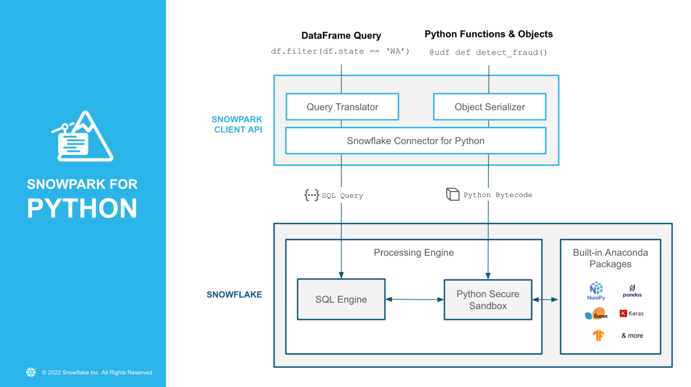
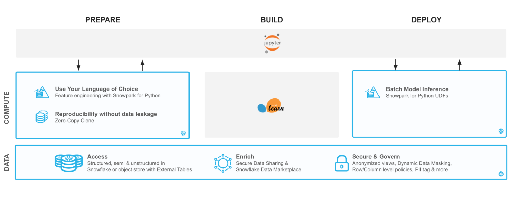

# Getting Started with Snowpark Python
<!-- ------------------------ -->
## Overview 


Python is the language of choice for Data Science and Machine Learning workloads. Snowflake has long supported Python via the Python Connector, allowing data scientists to interact with data stored in Snowflake from their preferred Python environment. This did, however, require data scientists to write verbose SQL queries. To provide a more friendly, expressive, and extensible interface to Snowflake, we built **Snowpark Python**, a native Python experience with a pandas and PySpark-like API for data manipulation. This includes a client-side API to allow users to write Python code in a Spark-like API without the need to write verbose SQL. Python UDF and Stored Procedure support also provides more general additional capabilities for compute pushdown.

Snowpark includes client-side APIs and server-side runtimes that extends Snowflake to popular programming languages including Scala, Java, and Python. Ultimately, this offering provides a richer set of tools for Snowflake users (e.g. Python’s extensibility and expressiveness) while still leveraging all of Snowflake’s core features, and the underlying power of SQL, and provides a clear path to production for machine learning products and workflows.

A key component of Snowpark for Python is that you can "Bring Your Own IDE"- anywhere that you can run a Python kernel, you can run client-side Snowpark Python. You can use it in your code development the exact same way as any other Python library or module. In this quickstart, we will be using Jupyter Notebooks, but you could easily replace Jupyter with any IDE of your choosing.

Throughout this quickstart, we will specifically explore the power of the Snowpark Python Dataframe API, as well as server-side Python runtime capabilities, and how Snowpark Python can enable and accelerate end-to-end Machine Learning workflows.

The source code for this quickstart is available on [GitHub](https://github.com/fenago/getting-started-snowpark-python).




### What You’ll Learn 
- How to create a DataFrame that loads data from a stage
- How to perform data and feature engineering using Snowpark DataFrame API
- How to bring a trained ML model into Snowflake as a UDF to score new data

### What You’ll Need 
- A Snowflake Account with [Anaconda Integration enabled by ORGADMIN]
- if you do not already have a Snowflake account, you can register for a [free trial account](https://signup.snowflake.com/)
- A Snowflake login with the `ACCOUNTADMIN` role. If you have this role in your corporate environment, you may choose to use it directly. If not, you will either need to (1) register for a free trial account above, (2) use a different role that has the ability to create and use a database, schema and tables, and UDFs (edit the `config.py` file and Jupyter notebooks to use this alternative role), OR (3) use an existing database and schema in which you can create tables and UDFs (edit the `config.py` file and notebook to use that role, database, and schema). If you're confused, it is best to just sign up for a free Enterprise-level trial account via the link above.
- Python 3.8
- Jupyter Notebook
- Snowpark Python 0.7.0 API (included in the [Quickstart GitHub repo](https://github.com/fenago/getting-started-snowpark-python))

### What You’ll Build 
You will build an end-to-end data science workflow leveraging Snowpark for Python to load, clean and prepare data and then deploy our trained model in Snowflake using Python UDF for inference.

<!-- ------------------------ -->
## Use-Case: Predicting Customer Churn


You are part of a team of data engineers and data scientists at a Telecom company that has been tasked to reduce customer churn using a machine learning based solution. 

To build this, you have access to customer demographic and billing data. Using Snowpark, we will ingest, analyze and transform this data to train a model that will then be deployed inside Snowflake to score new data. 



With Snowflake, it is easy to make all relevant data instantly accessible to your machine learning models whether it is for training or inference. For this guide, we are going to do all of our data and feature engineering with Snowpark for Python but users can choose to work with SQL or any of the other Snowpark supported languages including Java and Scala without the need for separate environments. 

To streamline your path to production, we will learn how to bring trained models (whether trained inside Snowflake or in an external environment) to run directly inside Snowflake as a UDF bringing models where the data and data pipelines live. 

<!-- ------------------------ -->
## Setup


Let's set up the Python environment necessary to run this quickstart:

First, clone the source code for this repo to your local environment (you can also download the code [here](https://github.com/fenago/getting-started-snowpark-python) and unzip the files into the location of your choosing in your local environment):
```bash
git clone git@github.com:Snowflake-Labs/sfguide-getting-started-snowpark-python.git
cd getting-started-snowpark-python/customer-churn-prediction
```

### Snowpark Python via Anaconda
If you are using [Anaconda](https://www.anaconda.com/python-r-distribution?utm_campaign=python&utm_medium=online-advertising&utm_source=google&utm_content=anaconda-download&gclid=Cj0KCQjwnNyUBhCZARIsAI9AYlFtPjClvSFJ8hUR4_IAtlQiDbNOm1QwqIzwf_bQvduX_OmrS8wtz5QaAhi8EALw_wcB) on your local machine, create a conda env for this quickstart:
```bash
conda env create -f jupyter_env.yml
conda activate getting_started_snowpark_python
```

Conda will automatically install `snowflake-snowpark-python==0.7.0` and all other dependencies for you.

Once Snowpark is installed, create a kernel for Jupyter:
```bash
python -m ipykernel install --user --name=getting_started_snowpark_python
```

Now, launch Jupyter Notebook on your local machine:
```bash
jupyter notebook
```

Open up the [`config.py`](https://github.com/fenago/getting-started-snowpark-python/blob/main/customer-churn-prediction/config.py) file in Jupyter and modify with your account, username, and password information:

If your Snowflake URL is https://mycompany-sandpit.snowflakecomputing.com/console/login#/ , your username is `THOMAS`, and the role you will use is `ACCOUNTADMIN`, then you would fill it in like so:
```json
snowflake_conn_prop = {

   "account": "mycompany-sandpit",

   "user": "THOMAS",

   "password": "YourPasswordHere",

   "role": "ACCOUNTADMIN",

   "database": "snowpark_quickstart",

   "schema": "TELCO",

   "warehouse": "sp_qs_wh",

}
```

Now, you are ready to get started with the notebooks. For each notebook, make sure that you select the `getting_started_snowpark_python` kernel when running. You can do this by navigating to: `Kernel -> Change Kernel` and selecting `getting_started_snowpark_python` after launching each Notebook.

<!-- ------------------------ -->
## Load Data Using Snowpark Python Client API


**Persona**: DBA/Platform Administrator/Data Engineer

**What You'll Do**: 
- Establish the Snowpark Python session
- Create the database, schema, and warehouses needed for the remainder of the lab
- Load raw parquet data into Snowflake using Snowpark Python

Open up the [`01-Load-Data-with-Snowpark`](https://github.com/fenago/getting-started-snowpark-python/blob/main/customer-churn-prediction/01-Load-Data-with-Snowpark.ipynb) Jupyter notebook and run each of the cells to explore loading and transforming data with Snowpark Python.

<!-- ------------------------ -->
## Analyze Data Using Snowpark Python Dataframe API


**Persona**: Data Scientist 

**What You'll Do**: 
- Understand and analyze the data set
- Perform data and feature discovery

Open up the [`02-Data-Analysis`](https://github.com/fenago/getting-started-snowpark-python/blob/main/customer-churn-prediction/02-Data-Analysis.ipynb) Jupyter notebook and run each of the cells to explore data analysis using Snowpark Python.

<!-- ------------------------ -->
## Deploy Trained Models using Snowpark Python UDFs


**Persona**: Data Scientist/ML Engineer

**What You'll Do**: 
- Perform feature selection, model training, and model seelction
- Deploy the model into Snowflake for inference using Snowpark Python UDFs

Open up the [`03-Snowpark-UDF-Deployment`](https://github.com/fenago/getting-started-snowpark-python/blob/main/customer-churn-prediction/03-Snowpark-UDF-Deployment.ipynb) Jupyter notebook and run each of the cells to train a model and deploy it for in-Snowflake inference using Snowpark Python UDFs

<!-- ------------------------ -->
## Conclusion


Through this Quickstart we were able to experience how Snowpark for Python enables you to use familiar syntax and constructs to process data where it lives with Snowflake’s elastic, scalable and secure engine, accelerating the path to production for data pipelines and ML workflows. Here’s what you were able to complete:

- Load data into a Snowpark DataFrame
- Clean and prepare data using the Snowpark DataFrame API
- Deploy a trained machine learning model in Snowflake as Python UDF
